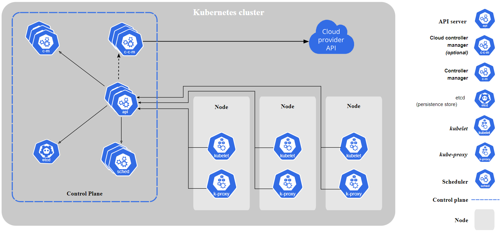
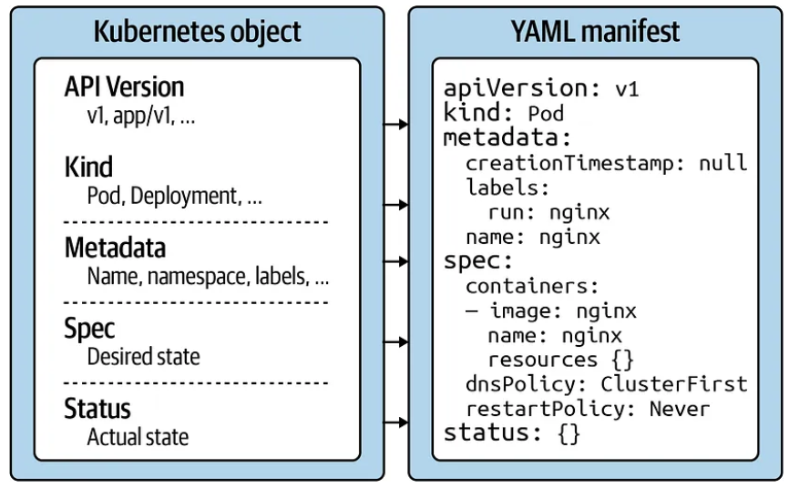

# Setting up the cluster

## What is a Kubernetes Cluster?

A Kubernetes cluster is a set of nodes that run containerized applications. These applications are packaged with their dependencies and some necessary services, making them more lightweight and flexible than virtual machines. Kubernetes clusters facilitate the development, movement, and management of applications across various environments, such as virtual, physical, cloud-based, and on-premises, without being restricted to a specific operating system.

## Core Components of a Kubernetes Cluster

A Kubernetes cluster consists of one master node and several worker nodes, which can be either physical computers or virtual machines.

### Master Node

Controls the state of the cluster, including which applications are running and which container images they use. It coordinates processes like scheduling and scaling applications, maintaining the cluster's state, and implementing updates.

#### Core components:

- **API Server:**
  - What it does: Exposes a REST interface to all Kubernetes resources and serves as the front end of the Kubernetes control plane.
  - Importance: It's the primary entry point for commands sent to the cluster via the `kubectl` command-line tool. Without the API Server, there would be no centralized way to manage and control the cluster.

- **Scheduler:**
  - What it does: Places containers based on resource requirements and metrics, and assigns nodes for them to run on.
  - Importance: Ensures efficient resource utilization by determining the best node for a pod to run on, considering current workloads and resource availability.

- **Controller Manager:**
  - What it does: Manages controller processes and reconciles the cluster's actual state with its desired state.
  - Importance: Helps maintain the desired state of the cluster. For instance, if a node fails, the Replication Controller ensures that the designated number of pod replicas are maintained, by creating a new pod on another node if necessary.

- **Etcd:**
  - What it does: Stores all cluster data and serves as a consistent and highly available Kubernetes backing store.
  - Importance: As the primary datastore for Kubernetes, etcd is crucial because it stores the configuration data of the cluster, representing the "source of truth" for the cluster. If etcd is lost, the cluster's data is lost, making it essential to have backups and ensure its resilience.

### Worker Nodes

Perform tasks assigned by the master node and can be virtual machines or physical computers.

#### Core components:

- **Kubelet:**
  - What it does: Ensures containers are running in a Pod by interacting with the container runtime (like Docker).
  - Importance: Acts as the bridge between the master and the nodes, ensuring the containers are running in a pod. Without the Kubelet, the Master wouldn't be able to coordinate and communicate with the nodes.

- **Kube-proxy:**
  - What it does: Manages network connectivity and maintains network rules across nodes.
  - Importance: Ensures that each pod can communicate with each other within the cluster, handling the routing and load balancing of network traffic.

### Namespace

In Kubernetes, a Namespace is a mechanism to divide cluster resources between multiple users, applications, or phases of a project. It provides a scope for names, allowing you to organize resources into isolated units, which can be particularly useful in environments with many users across multiple teams or projects. Namespaces are a way to divide cluster resources and can be used to enable patterns like microservices or multi-tenancy.

Namespaces allow you to manage resources under different scopes, providing several advantages:

- Isolation: Resources for one application or part of your organization can be isolated from others.
- Resource Management: You can allocate resources at the namespace level, helping to ensure fair resource usage across different applications or teams.
- Role-Based Access Control: Access to resources can be controlled at the namespace level, providing finer-grained control over resource access.
- Environment Separation: Different namespaces can be used to separate environments like development, testing, and production within the same cluster.

### Desired State and Control Plane

The Desired State is a crucial concept in Kubernetes, representing the user's intent for the system. It is defined using YAML or JSON configuration files, which describe how applications should run, the resources they should use, and how they should behave at runtime. The Desired State encompasses various aspects, such as the number of pod replicas, network settings, and storage resources.

However, merely defining the desired state isn't enough. The real magic of Kubernetes lies in its ability to make the actual state of the system match this desired state. This is where the Control Plane and the reconciliation loop come into play.

#### Reconciliation Loop

##### What is the Reconciliation Loop?

At its core, Kubernetes operates on a continuous loop called the reconciliation loop. This loop constantly checks the actual state of the system against the desired state you've defined.

If there's a discrepancy between the two states, Kubernetes takes corrective actions to reconcile them.

##### How Does It Work?

Controllers, which are part of the Control Plane, are responsible for specific kinds of resources in Kubernetes, such as Pods, Services, or Deployments.

Each controller continuously monitors its resources and compares the current state with the desired state.

If it detects a difference, the controller takes action to make them match. For example, if you've defined that you want three replicas of a particular Pod, but only two are running, the appropriate controller will start another Pod to meet the desired state.

##### Why is the Reconciliation Loop Important?

- Self-Healing: If a Pod crashes or a node fails, Kubernetes automatically detects the discrepancy and works to correct it, ensuring high availability.
- Scaling: If you decide to scale up or down, the reconciliation loop ensures that the actual number of running instances matches your specifications.
- Updates & Rollbacks: When updating applications or configurations, Kubernetes gradually rolls out changes, ensuring that at any given time, the system is as close to the desired state as possible. If issues arise, it can automatically rollback to a previous state.

**API version**

The Kubernetes API version defines the structure of a primitive and uses it to validate the correctness of the data. The API version serves a similar purpose as XML schemas to an XML document or JSON schemas to a JSON document. The version usually undergoes a maturity process — e.g., from alpha to beta to final. Sometimes you see different prefixes separated by a slash (e.g., apps). You can list the API versions compatible with your cluster version by running the command `kubectl api-versions`.

**Kind**

The kind defines the type of primitive — e.g., a Pod or a Service. It ultimately answers the question, "What type of object are we dealing with here?"

**Metadata**

Metadata describes higher-level information about the object — e.g., its name, what namespace it lives in, or whether it defines labels and annotations. This section also defines the UID.

**Spec**

The specification ("spec" for short) declares the desired state — e.g., how should this object look after it has been created? Which image should run in the container, or which environment variables should be set for?

**Status**

The status describes the actual state of an object. The Kubernetes controllers and their reconciliation loops constantly try to transition a Kubernetes object from the desired state into the actual state. The object has not yet been materialized if the YAML status shows the value {}.

So in conclusion, the Control Plane is responsible for maintaining the actual state of the cluster in alignment with the Desired State. It continuously monitors the cluster and makes necessary adjustments to bring the actual state closer to the user-defined Desired State.

The interaction between the Desired State and the Control Plane ensures that resources are allocated, scaled, and managed efficiently, adhering to the defined configurations and maintaining system stability and reliability.

## Automation and Management

Kubernetes excels in Automation and Management of containerized applications across clusters, providing several capabilities that enhance the deployment, scaling, and management of applications:

- **Automated Deployment:** Kubernetes can automatically deploy applications based on the defined Desired State, ensuring that the specified number of pod replicas are running and available at all times.

- **Self-Healing:** Kubernetes automatically replaces and reschedules containers from failed nodes. It kills and replaces containers that don't respond to user-defined health checks, and it doesn't advertise them to clients until they are ready to serve.

- **Rolling Updates & Rollbacks:** Kubernetes can roll out updates to applications or configurations in a controlled and gradual manner, ensuring system stability. If an issue is detected during an update, Kubernetes can automatically rollback the changes, minimizing downtime and impact.

- **Load Balancing:** Kubernetes provides inherent load balancing for network traffic to applications, ensuring that no single node is overwhelmed with too much load, and thus, maintaining the stability and reliability of the services.

- **Auto-Scaling:** Kubernetes can scale applications up or down automatically by adjusting the number of running containers, based on CPU utilization or other select metrics. It can also scale resources in response to user-defined custom metrics.

- **Resource Management:** Kubernetes allows you to specify how much CPU and memory (RAM) each container needs, ensuring optimal allocation of resources.

Kubernetes' automation and management capabilities ensure that applications are running efficiently, reliably, and securely across the cluster, adhering to the defined configurations and adjusting to changes and demands dynamically.

## Cloud-based vs. Local Clusters in Kubernetes

### Introduction to Cloud-based and Local Clusters

- **Cloud-based Clusters:** These are Kubernetes clusters that are hosted on a cloud platform, such as AWS, Google Cloud, or Azure. They provide scalability, high availability, and a pay-as-you-go pricing model.

- **Local Clusters:** These are Kubernetes clusters set up in a local environment, such as a personal computer or an on-premises data center. They are suitable for development, testing, and small-scale deployment.

### Advantages and Disadvantages

**Cloud-based Clusters:**

- **Advantages:** Scalability, managed services, global reach, and reduced hardware management.

- **Disadvantages:** Costs can escalate with usage, potential for vendor lock-in, and data sovereignty concerns.

**Local Clusters:**

- **Advantages:** Full control over the environment, no direct costs related to usage, and data remains on-premises.

- **Disadvantages:** Limited scalability, hardware management, and potential for higher upfront costs.

### Use Cases and Suitability

**Cloud-based Clusters:** Ideal for organizations that require global reach, scalable resources, and do not want to manage hardware. Suitable for production environments and large-scale applications.

**Local Clusters:** Suitable for development and testing phases, small-scale applications, or when data needs to be kept in-house due to regulatory requirements.

### Management and Operations

**Cloud-based Clusters:** Often come with managed Kubernetes services (e.g., Amazon EKS, Google Kubernetes Engine) that handle backend tasks like patching, scaling, and maintaining the control plane.

**Local Clusters:** Require manual setup and management of the Kubernetes control plane, nodes, and underlying infrastructure.

### Security and Compliance

**Cloud-based Clusters:** Security is shared between the cloud provider and the user. Compliance can be easier to achieve due to the provider's certifications and security mechanisms.

**Local Clusters:** Security and compliance are entirely in the hands of the organization, providing more control but also requiring more effort to establish and maintain secure practices.

### Cost Implications

**Cloud-based Clusters:** Costs are variable and depend on usage, resources consumed, and additional services utilized.

**Local Clusters:** Costs are related to hardware procurement, maintenance, and potential upgrades, but usage does not incur additional direct costs.

### Scalability and Availability

**Cloud-based Clusters:** Provide auto-scaling capabilities and high availability configurations across multiple geographical regions.

**Local Clusters:** Scalability is limited to available local resources, and high availability may require additional configurations and hardware.

### Development and Deployment Workflow

**Cloud-based Clusters:** Enable seamless deployment with CI/CD integrations and are accessible from anywhere, facilitating remote development and collaboration.

**Local Clusters:** May require additional setup for CI/CD integrations and remote access, potentially complicating remote development workflows.

# Introduction to Minikube

Minikube is a free and open-source tool designed to set up a single-node Kubernetes cluster on a local machine. It's particularly useful for individuals who are new to Kubernetes and want to learn and experiment.

## Features of Minikube:

- **Isolation:** Minikube provides an isolated environment to learn and test Kubernetes. Any operations you perform won't affect any other Kubernetes setup you might have.

- **Add-ons:** Minikube supports various add-ons like dashboard, monitoring, logging, and more, which can enhance the local Kubernetes experience.

- **Driver Support:** Minikube can run on various virtualization platforms like VirtualBox, VMware, Hyper-V, and even Docker.

## Setting Up Minikube and Using kubectl

### Step-by-Step Guide to Setting Up Minikube:

#### Windows setup:

1. Ensure Hyper-V is Enabled:

   Hyper-V is a native hypervisor for Windows. Before starting, ensure that Hyper-V is enabled on your machine. If not, you can enable it via the "Turn Windows features on or off" option in the Control Panel.

2. Install Chocolatey:

   Chocolatey is a package manager for Windows. It simplifies the installation of software on Windows machines.

   Open a command prompt as an administrator and run the following command:

   Set-ExecutionPolicy Bypass -Scope Process -Force; [System.Net.ServicePointManager]::SecurityProtocol = [System.Net.ServicePointManager]::SecurityProtocol -bor 3072; iex ((New-Object System.Net.WebClient).DownloadString('https://chocolatey.org/install.ps1'))

3. Install Minikube:

   Using Chocolatey, install Minikube with the following command:

   choco install minikube

4. Install kubectl:

   kubectl is a command-line tool to interact with Kubernetes clusters.

   Install it using Chocolatey:

   choco install kubernetes-cli

5. Start Minikube with Hyper-V Driver:

   Now that Hyper-V is ensured to be active and Minikube is installed, start Minikube using the Hyper-V driver:

   minikube start --driver=hyperv --memory=2048

#### MacOS setup:

1. Install Homebrew:

   If you don't have Homebrew installed, you can install it with the following command:

   /bin/bash -c "$(curl -fsSL https://raw.githubusercontent.com/Homebrew/install/HEAD/install.sh)"

2. Install Minikube and kubectl:

   Using Homebrew, install Minikube and kubectl:

   brew install minikube kubernetes-cli

3. Start Minikube:

   Now that Minikube is installed, start Minikube using:

   minikube start

#### Linux setup:

1. Install Minikube:

   Use the following commands to download and install Minikube:

   curl -Lo minikube https://storage.googleapis.com/minikube/releases/latest/minikube-linux-amd64
   chmod +x minikube
   sudo mv minikube /usr/local/bin/

2. Install kubectl:

   Download and install kubectl:

   curl -LO "https://dl.k8s.io/release/$(curl -L -s https://dl.k8s.io/release/stable.txt)/bin/linux/amd64/kubectl"
   chmod +x kubectl
   sudo mv kubectl /usr/local/bin/

3. Start Minikube:

   Start Minikube with the default driver:

   minikube start

### Verify Installation:

- Once Minikube starts successfully, you can check the status of the cluster with: **minikube status**
- You should see that Minikube is running.

**Interacting with the Cluster** :

- Use **kubectl** to interact with your cluster. For instance, to view nodes in the cluster, run: **kubectl get nodes**

**Stopping and Starting the Cluster** :
- To stop the Minikube cluster, simply run: **minikube stop**
- To start it again, use the **minikube start** command.

**Accessing the Kubernetes Dashboard** : Minikube comes with a built-in dashboard. You can access it using **minikube dashboard** , which will open the dashboard in your default browser. **Deleting the Cluster** : Once you're done, you can delete the Minikube cluster **minikube delete**.

## Understanding Desired State in Kubernetes
**A. Introduction to Desired State**
- Explain that in Kubernetes, the desired state is a declaration of how the system should look and behave.
- This is typically defined using YAML or JSON configuration files.

**B. Creating a Simple Deployment**
1. Create a simple deployment using a basic nginx image:
**kubectl create deployment nginx-demo --image=nginx**
1. Verify the deployment:
**kubectl get deployments**
1. Check the pods created by the deployment:
**kubectl get pods**

**C. Demonstrating Desired State in Action**
1. Explain that the deployment has a desired state of having one replica of the nginx pod running.
2. Manually delete the nginx pod:
**kubectl delete pod [POD\_NAME]** Replace **[POD\_NAME]** with the name of the nginx pod you got from the previous command.
1. Immediately after, check the pods again:
**kubectl get pods**
1. Highlight the fact that even though you deleted the pod, a new one was immediately created to match the desired state of the deployment.

**D. Modifying the Desired State**
1. Scale the deployment to have three replicas:
**kubectl scale deployment nginx-demo --replicas=3**
1. Check the deployment and pods:
2. Point out that now there are three nginx pods running, matching the new desired state.

**E. Cleanup kubectl get deployments kubectl get pods**
1. Delete the deployment:
**kubectl delete deployment nginx-demo**

## Demonstrating Auto-Scaling in Kubernetes
A. Introduction to Auto-Scaling
- Kubernetes can automatically scale the number of pods based on certain metrics like CPU utilization or custom metrics.
- Introduce the Horizontal Pod Autoscaler (HPA), which automatically scales the number of pods in a deployment or replica set based on observed metrics.

B. Setting Up Metrics Server
- For HPA to work, you need the Metrics Server running in your cluster. If you're using Minikube, it's straightforward:
**minikube addons enable metrics-server**
- Wait a few minutes for the Metrics Server to collect data.

C. Deploying a Sample Application
- Deploy a sample application using the nginx image:
**kubectl create deployment nginx-demo --image=nginx**
- Expose the deployment:
kubectl expose deployment nginx-demo --type=LoadBalancer --port=80
- **Important** : Ensure that the deployment has resource requests set, especially for CPU. This is crucial for the HPA to make scaling decisions:
**kubectl set resources deployment nginx-demo --requests=cpu=100m**

D. Setting Up Horizontal Pod Autoscaler (HPA)
- Create an HPA that scales the nginx-demo deployment based on CPU utilization:
**kubectl autoscale deployment nginx-demo --cpu-percent=30 --min=1 --max=10**
- This command means that if the CPU usage exceeds 50%, Kubernetes will try to scale out the number of pods, up to a maximum of 10 pods.

E. Generating Load
- To simulate traffic and increase CPU usage, you can use a tool like **hey** or **wrk**. For this example, let's use a simple infinite loop:
**kubectl run -i --tty load-generator --image=busybox /bin/sh**
- Once inside the container:
**while true; do wget -q -O- http://nginx-demo.default.svc.cluster.local; done**
- Let this run for a few minutes.

F. Observing Auto-Scaling in Action
- Monitor the HPA:
**kubectl get hpa**
- You should see the CURRENT number of replicas increase as the CPU utilization goes up.
- Also, monitor the pods:
**kubectl get pods**
- You'll notice more pods being created to handle the increased load.

G. Cleanup
- Delete the load generator:
**kubectl delete deployment load-generator**
- Delete the HPA:
**kubectl delete hpa nginx-demo**
- Delete the nginx-demo deployment and service:
**kubectl delete deployment nginx-demo kubectl delete service nginx-demo**

**References**
- Kubernetes (n.d.). Minikube. Retrieved from [https://kubernetes.io/docs/setup/learning-environment/minikube/](https://kubernetes.io/docs/setup/learning-environment/minikube/)
- Google Cloud (n.d.). Google Kubernetes Engine. Retrieved from [https://cloud.google.com/kubernetes-engine](https://cloud.google.com/kubernetes-engine)
- AWS (n.d.). Amazon Elastic Kubernetes Service. Retrieved from [https://aws.amazon.com/eks/](https://aws.amazon.com/eks/)
- VirtualBox (n.d.). VirtualBox. Retrieved from [https://www.virtualbox.org/](https://www.virtualbox.org/)
- Chocolatey (n.d.). Chocolatey Software. Retrieved from [https://chocolatey.org/](https://chocolatey.org/)
- Kubernetes official documentation on Pods [https://minikube.sigs.k8s.io/docs/drivers/hyperv/](https://minikube.sigs.k8s.io/docs/drivers/hyperv/)
- Kubernetes official documentation for kubectl [https://kubernetes.io/docs/reference/kubectl/](https://kubernetes.io/docs/reference/kubectl/)
