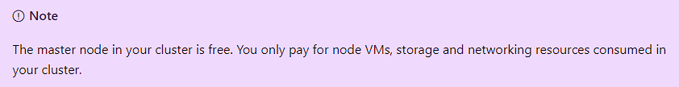
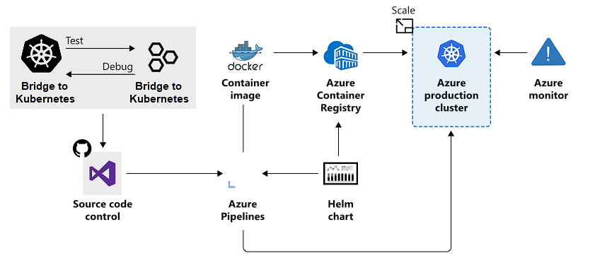

At its core, an AKS cluster is a cloud-hosted Kubernetes cluster. Unlike a custom installation, AKS streamlines the installation process and takes care of most underlying cluster management tasks.

When you create an AKS, the initial node pool size defaults to two nodes. However, for a production environment, it is recommended to use at least three.

## How workloads are developed and deployed to AKS

AKS supports the Docker image format. This means that you can use any development environment to create a workload, package the workload as a container, and deploy the container as a Kubernetes pod.

### Bridge to Kubernetes

With this, you can run and debug code on your development computer while still connected to your cluster with the rest of your application or services.

### Deployment Center

This simplifies setting up a DevOps pipeline for your application. You can use this configured DevOps pipeline to set up CI and CD pipelines to your AKS cluster.
