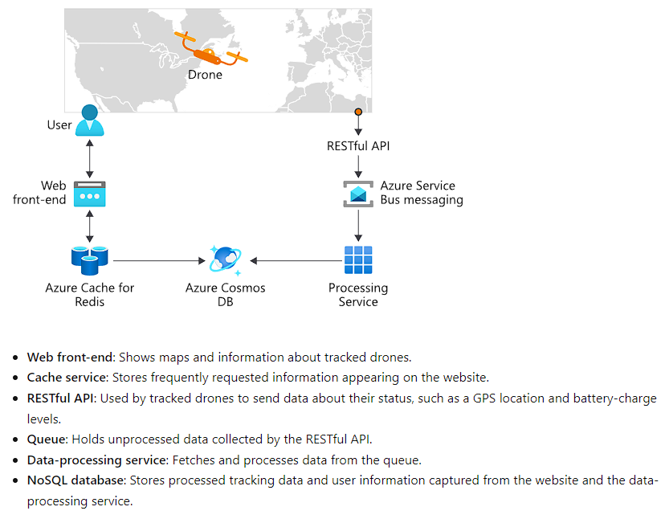

[Source](https://learn.microsoft.com/en-us/training/modules/intro-to-kubernetes/2-what-is-kubernetes)

## Kubernetes to Turn Containers into Microservices

Kubernetes enables developers to easily scale their applications up and down by spinning up more containers or decreasing the total number of containers being run.

## What is Container Management?

Container management consists of organizing, adding, removing, or updating a significant number of containers.

An example drone-tracking app consists of multiple microservices responsible for tasks like:

1. Caching
2. Data processing
3. Queuing

Each of these services is hosted in a container and can be deployed, updated, and scaled independently from each other.

## Container Orchestration

An orchestration system can automatically deploy and manage containers. It can automatically increase or decrease the number of deployed containers or ensure that all deployed containers are updated to a new version if an update is available.

## Define Kubernetes

Kubernetes is a portable, extensible open-source platform for managing and orchestrating containerized workloads.

The main benefits of Kubernetes are based on the abstraction of tasks such as:

1. Self-healing of containers; for example, restarting containers that fail or replacing containers.
2. Scaling deployed containers up or down dynamically, based on demand.
3. Automating rolling updates and rollbacks of containers.
4. Managing storage.
5. Managing network traffic.
6. Storing and managing sensitive information such as usernames and passwords.

## Considerations

- Aspects such as deployment, scaling, load balancing, logging, and monitoring are all optional; you are responsible for finding the best solution that fits your needs.
- If your app can run in a container, then it can run on Kubernetes.
- Cloud services such as Azure Kubernetes Services reduce many challenges by providing an environment.

---

[Source](https://learn.microsoft.com/en-us/training/modules/intro-to-kubernetes/3-how-kubernetes-works)

# Understanding How Kubernetes Works

This section explains all the components that make up a Kubernetes installation.

## What is a Computer Cluster?

A cluster is a set of computers configured to work together as a single system. The cluster uses centralized software responsible for scheduling and controlling tasks. Computers running tasks are called nodes, and those running scheduling software are called control planes.

## Architecture

Kubernetes serves as the orchestration and cluster software to deploy apps and respond to changes in compute resource needs.

A cluster contains at least one control plane and one or more nodes. The default host OS in Kubernetes is Linux.

## Kubernetes Control Plane

The control plane in a cluster runs a collection of services responsible for managing orchestration functionality in Kubernetes.

## Kubernetes Node

A node in a cluster is where compute workloads run, communicating with the control plane via the API server to report state changes.

## Services on a Control Plane

Services within the control plane manage aspects such as cluster-component communication, workload scheduling, and cluster-state persistence.

- **Kube-api-server**: The front end of the cluster's control plane, handling all communication between Kubernetes components.
- **ETCD**: A persistence store for saving the complete cluster configuration, including the current and desired state of all objects.
- **Scheduler**: Assigns workloads to nodes.
- **Controller**: Launches and monitors controllers configured for the cluster. Controllers track object states and respond to events in the cluster, e.g., monitoring nodes, containers, and endpoints.

## Services that Run on a Node

The following services can run on a node:

- **Kubelet**: Monitors work requests from the API server, ensuring the requested unit of work is running and healthy.
- **Kube-Proxy**: Responsible for local cluster networking, ensuring each node has a unique IP address, and handling routing and load balancing of traffic using iptables and IPVS.
- **Container Runtime**: The underlying software for running containers, responsible for fetching, starting, and stopping container images.

## Interacting with a Cluster

Kubernetes provides a command-line tool called `kubectl` to manage clusters. Use `kubectl` to send commands to the control plane or fetch information about all objects via the API server.

## Kubernetes Pods

A pod represents a single instance of an app running in Kubernetes. Workloads in Kubernetes are containerized apps. Unlike in a Docker environment, containers are not run directly in Kubernetes; they are packaged into a pod. A pod is the smallest object you can create in Kubernetes.

A single pod can hold one or more containers, but it doesn't contain multiples of the same app.

### Pod Lifecycle

A pod has a distinct lifecycle that affects how you deploy, run, and update pods.

Whenever a pod is deleted, it will be replaced by a new pod, unless the user explicitly specifies otherwise.

---

**Source:** [https://learn.microsoft.com/en-us/training/modules/intro-to-kubernetes/4-how-app-deployments-work](https://learn.microsoft.com/en-us/training/modules/intro-to-kubernetes/4-how-app-deployments-work)

An example app has several components that are deployed separately from each other. If you use Kubernetes, then it's your job to configure the deployments on the cluster.

## Pod Deployment Options

When you use the `kubectl` command, you have several options to manage the deployment of pods, such as:

- Pod templates
- Replication controllers
- Replica sets
- Deployments

These fields make use of YAML to describe the intended state of the pod or pods to be deployed.

### What is a pod template?

A pod template describes the configuration of the pod you wish to deploy. The template contains information such as the name of the container image and which container registry to use to fetch the images. 

These templates are also defined using YAML in the same way you would define Docker files.

If you manually deploy a template, then it will not relaunch after it fails automatically. To manage the lifecycle of a pod, you need to create a higher-level Kubernetes object.

### What is a replication controller?

A replication controller uses pod templates and defines a specified number of pods that must run. The controller helps you run multiple instances of the same pod and ensures pods are always running on one or more nodes in the cluster.

The controller replaces running pods in this way with new pods if they fail, are deleted, or are terminated.

---

**Source:** [When to use Kubernetes - Training | Microsoft Learn](#)

The decision to use a container orchestration platform like Kubernetes depends on business and development requirements. 

The solution you built should be built as microservices that are designed as loosely coupled, collaborative services.

An example on how you could design a service which uses Kubernetes:

You want Kubernetes if you or your company:

- Develops apps as microservices
- Develops apps as cloud-native applications
- Deploys microservices by using containers
- Updates containers at scale
- Requires centralized container networking and storage management.

---

**Source:** [What is Azure Kubernetes Service? - Training | Microsoft Learn](#)

Azure Kubernetes Service (AKS) manages your hosted Kubernetes environment and makes it simple to deploy and manage containerized apps in Azure. Your AKS environment is enabled with features such as automated updates, self-healing, and easy scaling. The cluster is managed by Azure and is free. You manage the agent nodes in the cluster and only pay for the VMs on which your nodes run.

With AKS, you get the benefits of open-source Kubernetes without the complexity of operational overhead compared to running your own, custom cluster.

---

At its core, an AKS cluster is a cloud-hosted Kubernetes cluster. Unlike a custom installation, AKS streamlines the installation process and takes care of most underlying cluster management tasks.

When you create an AKS, the initial node pool size defaults to two nodes. However, for a production environment, it is recommended to use at least three.

## How workloads are developed and deployed to AKS

AKS supports the Docker image format. This means that you can use any development environment to create a workload, package the workload as a container, and deploy the container as a Kubernetes pod.

### Bridge to Kubernetes

With this, you can run and debug code on your development computer while still connected to your cluster with the rest of your application or services.

### Deployment Center

This simplifies setting up a DevOps pipeline for your application. You can use this configured DevOps pipeline to set up CI and CD pipelines to your AKS cluster.

---

Pods are the smallest deployable units of computing that can be created and managed in Kubernetes.

A Pod is a group of one or more containers that share storage and network resources, and a specification for how to run the containers. A pod's contents are always co-located and co-scheduled, and run in a shared context. A Pod models an application-specific "logical host": It contains one or more application containers that are relatively tightly coupled.

In non-cloud contexts, applications executed on the same physical or virtual machine are analogous to cloud applications executed on the same logical host. 
**Source:** [Pods | Kubernetes](#)

Pods are generally not created directly and are created using workload resources such as Deployment or Job. If your Pods need to track state, consider the StatefulSet resource. Pods in a Kubernetes cluster are used in two main ways:

1. Pods that run a single container.
2. Pods that run multiple containers and need to work together. A pod can encapsulate an application composed of multiple co-located containers that are tightly coupled and need to share resources. These co-located containers form a single cohesive unit of service - for example, one container serving data stored in a shared volume to the public, while a separate sidecar container refreshes or updates those files.

## Creating a Pod

You can create a pod by using the `kubectl apply` command with a YAML file that describes the Pod's configuration. Example:

You could save this file as "nginx-pod.yaml" and then execute the following command:

