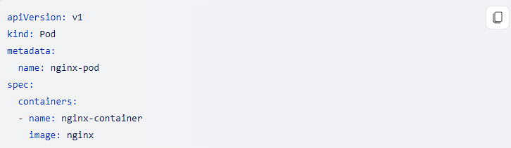
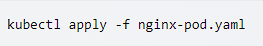

Pods are the smallest deployable units of computing that can be created and managed in Kubernetes.

A Pod is a group of one or more containers that share storage and network resources, and a specification for how to run the containers. A pod's contents are always co-located and co-scheduled, and run in a shared context. A Pod models an application-specific "logical host": It contains one or more application containers that are relatively tightly coupled.

In non-cloud contexts, applications executed on the same physical or virtual machine are analogous to cloud applications executed on the same logical host. 
**Source:** [Pods | Kubernetes](#)

Pods are generally not created directly and are created using workload resources such as Deployment or Job. If your Pods need to track state, consider the StatefulSet resource. Pods in a Kubernetes cluster are used in two main ways:

1. Pods that run a single container.
2. Pods that run multiple containers and need to work together. A pod can encapsulate an application composed of multiple co-located containers that are tightly coupled and need to share resources. These co-located containers form a single cohesive unit of service - for example, one container serving data stored in a shared volume to the public, while a separate sidecar container refreshes or updates those files.

## Creating a Pod

You can create a pod by using the `kubectl apply` command with a YAML file that describes the Pod's configuration. Example:

You could save this file as "nginx-pod.yaml" and then execute the following command:

