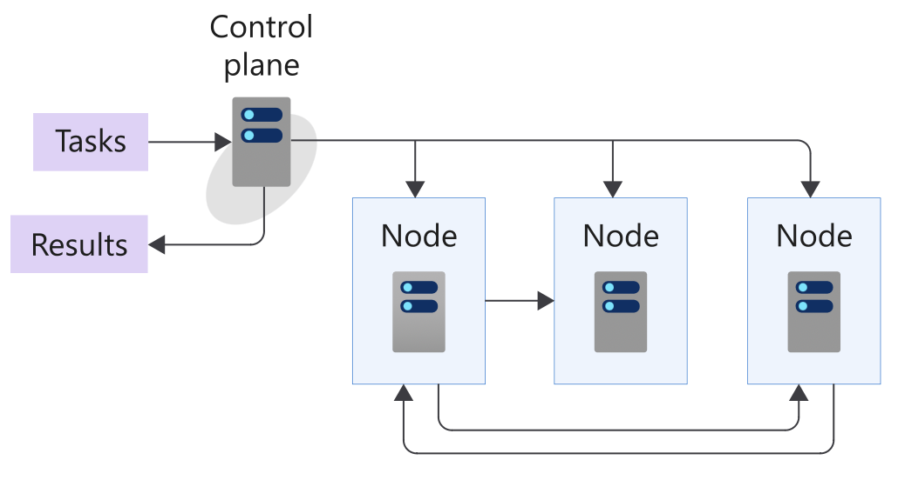
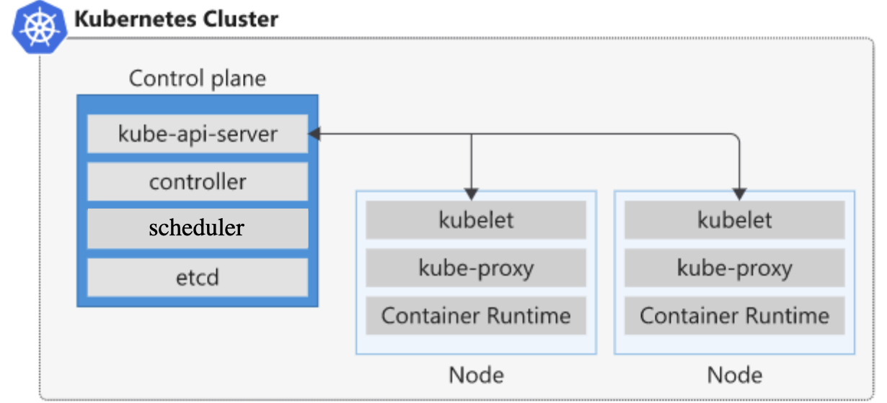
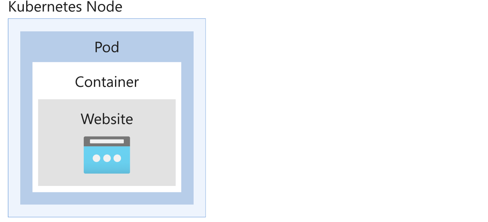

[Source](https://learn.microsoft.com/en-us/training/modules/intro-to-kubernetes/3-how-kubernetes-works)

# Understanding How Kubernetes Works

This section explains all the components that make up a Kubernetes installation.

## What is a Computer Cluster?

A cluster is a set of computers configured to work together as a single system. The cluster uses centralized software responsible for scheduling and controlling tasks. Computers running tasks are called nodes, and those running scheduling software are called control planes.

## Architecture

Kubernetes serves as the orchestration and cluster software to deploy apps and respond to changes in compute resource needs.

A cluster contains at least one control plane and one or more nodes. The default host OS in Kubernetes is Linux.

## Kubernetes Control Plane

The control plane in a cluster runs a collection of services responsible for managing orchestration functionality in Kubernetes.

## Kubernetes Node

A node in a cluster is where compute workloads run, communicating with the control plane via the API server to report state changes.

## Services on a Control Plane

Services within the control plane manage aspects such as cluster-component communication, workload scheduling, and cluster-state persistence.

- **Kube-api-server**: The front end of the cluster's control plane, handling all communication between Kubernetes components.
- **ETCD**: A persistence store for saving the complete cluster configuration, including the current and desired state of all objects.
- **Scheduler**: Assigns workloads to nodes.
- **Controller**: Launches and monitors controllers configured for the cluster. Controllers track object states and respond to events in the cluster, e.g., monitoring nodes, containers, and endpoints.

## Services that Run on a Node

The following services can run on a node:

- **Kubelet**: Monitors work requests from the API server, ensuring the requested unit of work is running and healthy.
- **Kube-Proxy**: Responsible for local cluster networking, ensuring each node has a unique IP address, and handling routing and load balancing of traffic using iptables and IPVS.
- **Container Runtime**: The underlying software for running containers, responsible for fetching, starting, and stopping container images.

## Interacting with a Cluster

Kubernetes provides a command-line tool called `kubectl` to manage clusters. Use `kubectl` to send commands to the control plane or fetch information about all objects via the API server.

## Kubernetes Pods

A pod represents a single instance of an app running in Kubernetes. Workloads in Kubernetes are containerized apps. Unlike in a Docker environment, containers are not run directly in Kubernetes; they are packaged into a pod. A pod is the smallest object you can create in Kubernetes.

A single pod can hold one or more containers, but it doesn't contain multiples of the same app.

### Example:

Pod Lifecycle

A pod has a distinct lifecycle that affects how you deploy, run, and update pods.

Whenever a pod is deleted, it will be replaced by a new pod, unless the user explicitly specifies otherwise.
