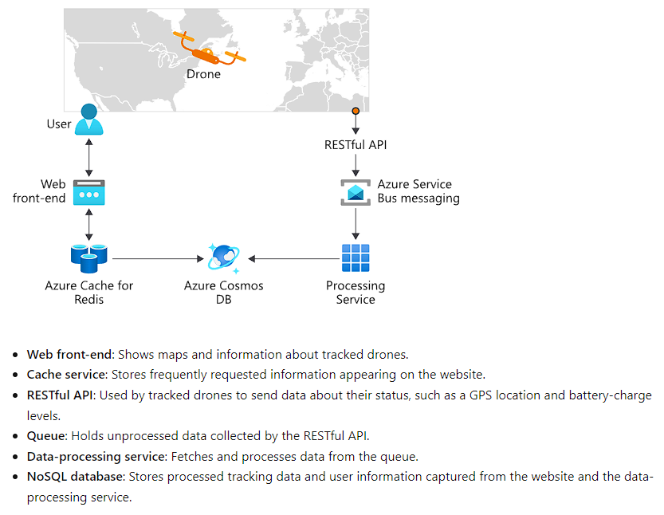

**Source:** [When to use Kubernetes - Training | Microsoft Learn](#)

The decision to use a container orchestration platform like Kubernetes depends on business and development requirements. 

The solution you built should be built as microservices that are designed as loosely coupled, collaborative services.

An example on how you could design a service which uses Kubernetes:

You want Kubernetes if you or your company:

- Develops apps as microservices
- Develops apps as cloud-native applications
- Deploys microservices by using containers
- Updates containers at scale
- Requires centralized container networking and storage management.
